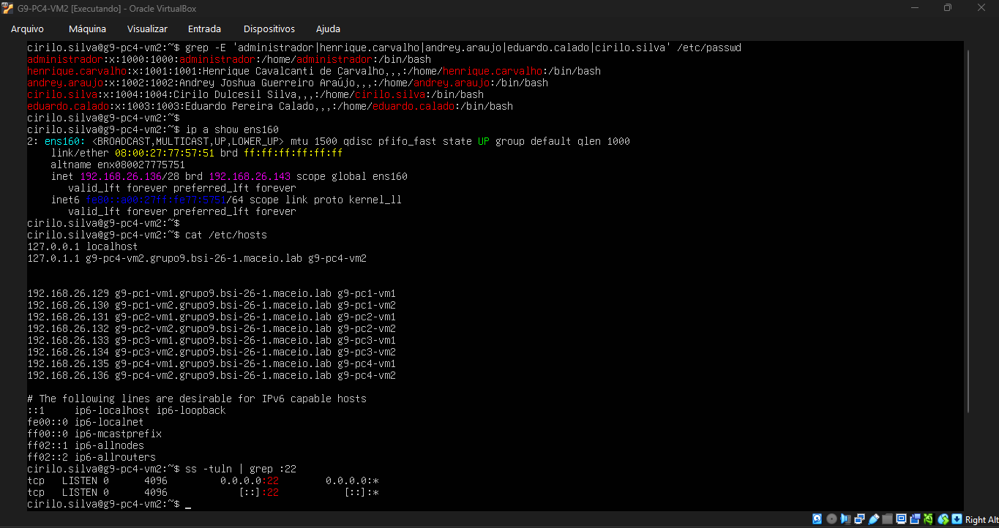
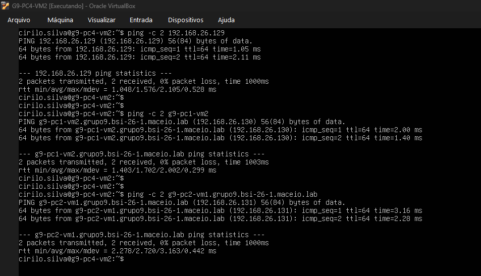
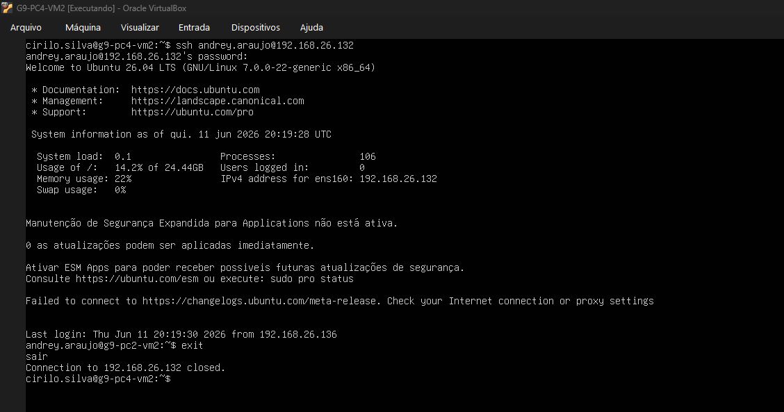
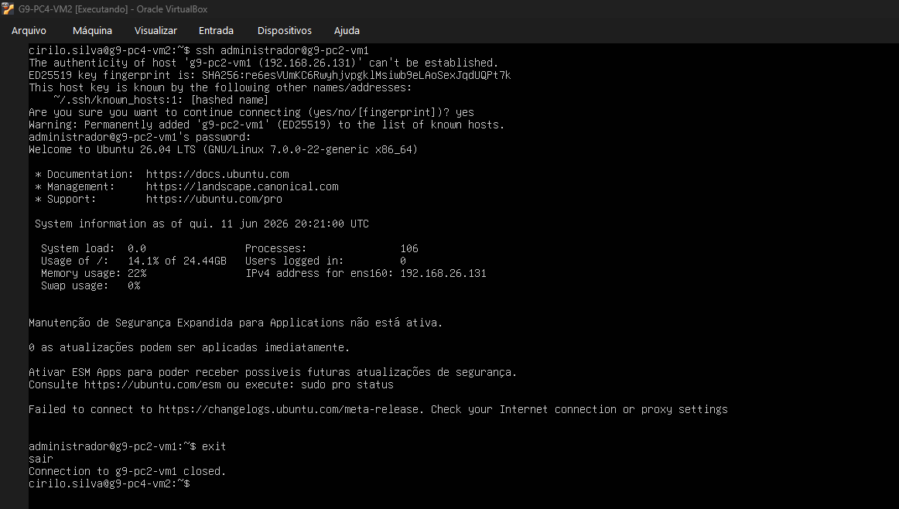

# Relatório Técnico Individual - PC 4 - VM 2

## 🖥️ Informações Gerais da Máquina
* **Responsável pelo Teste:** Cirilo
* **Hostname:** g9-pc4-vm2
* **FQDN:** g9-pc4-vm2.grupo9.bsi-26-1.maceio.lab
* **IP Dedicado:** 192.168.26.136

## Parte 1: Testes Locais (Configuração Interna)
Comandos executados localmente para garantir a integridade dos serviços e usuários na própria máquina virtual.

### 1. Verificação de Usuários Criados
```bash
grep -E 'administrador|henrique.carvalho|andrey.araujo|eduardo.calado|cirilo.silva' /etc/passwd
```

### 2. Validação do Endereçamento IP Local
```bash
ip a show ens160
```

### 3. Validação dos Hostnames Mapeados
```bash
cat /etc/hosts
```

### 4. Status do Serviço SSH (Porta 22 Aberta)
```bash
ss -tuln | grep :22
```

*<p align="center">Figura 1: Retorno dos testes de validação local (IP, Hostname, FQDN e porta 22).</p>*

## Parte 2: Testes de Conectividade (Matriz de Rede)

Comandos executados a partir desta VM de origem direcionados aos destinos estipulados na matriz de conectividade do grupo.

1. **Teste 1: Ping por IP** (Alvo: VM 1)
```bash
ping -c 2 192.168.26.129
```

2. **Teste 2: Ping por Hostname** (Alvo: VM 2)
```bash
ping -c 2 g9-pc1-vm2
```

3. **Teste 3: Ping por FQDN** (Alvo: VM 3)
```bash
ping -c 2 g9-pc2-vm1.grupo9.bsi-26-1.maceio.lab
```

*<p align="center">Figura 2: Retorno dos testes de ping por IP, Hostname e FQDN.</p>*

4. **Teste 4: SSH por IP** (Alvo: VM 4 | Usuário: andrey.araujo)
```bash
ssh andrey.araujo@192.168.26.132
```

*<p align="center">Figura 3: Retorno do teste SSH por IP.</p>*

5. **Teste 5: SSH por Hostname** (Alvo: VM 5 | Usuário: administrador)
```bash
ssh administrador@g9-pc3-vm1
```

*<p align="center">Figura 4: Retorno do teste SSH por Hostname.</p>*

6. **Teste 6: Script de testes**
```bash
# Para visualizar completo podendo mover com as setas 
sudo bash validation.sh | less -R
```

*<p align="center">Gif 1: Retorno do script de teste.</p>*
