# Parte 1: Inicialização e Construção da VM Matriz

### 1.1 Configuração e Parametrização da VM

Na janela inicial do assistente de criação do VirtualBox, definiu-se a identidade da máquina de referência, o diretório de armazenamento e o mapeamento da imagem de boot do sistema operacional:

*<p align="center">Figura 1: Definição do nome da VM Matriz, diretório de destino e mapeamento da imagem ISO do Ubuntu Server.</p>*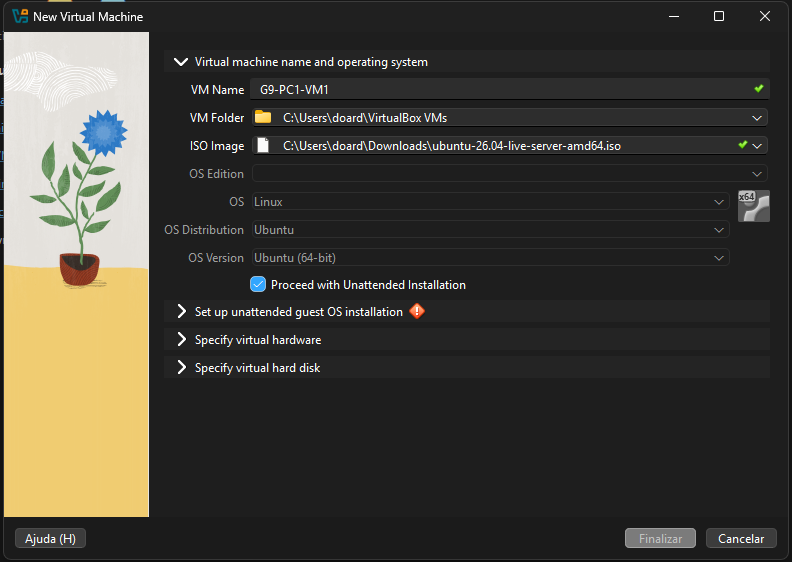

Durante a etapa de configuração de instalação, foram estabelecidos os seguintes parâmetros de identidade local e de rede:
* **User name (Usuário Administrador Base):** `administrador`
* **Senha padrão:** `adminifal`
* **Domain Name (Domínio de Rede):** `grupo9.bsi-26-1.maceio.lab`

Além disso, manteve-se ativa a opção de instalação automática dos adicionais de convidado (*Guest Additions*) para otimização de drivers do hipervisor.

*<p align="center">Figura 2: Parametrização das credenciais administrativas de segundo plano, nome de host e domínio da sub-rede do Grupo 9.</p>*

#### Requisitos de Memória e Disco para Instalação por ISO

* **Memória RAM:** 2 GB  por VM
* **Armazenamento em Disco:** 25 GB VDI Dinâmico

A alocação de 2GB RAM e 25GB VDI dinâmico é feito de forma automática pelo VirtualBox e não é preciso alterar.

Estes requisitos de hardware foram definidos em conformidade com a [Documentação de Requisitos Mínimos do Ubuntu Server](https://ubuntu.com/server/docs/reference/installation/system-requirements/#system-requirements), que estabelece uma RAM sugerida de 3 GB (adotamos 2GB que ainda fica no mínimo recomendado) e 25 GB de espaço em disco para instalações realizadas via mídia ISO corporativa (adotado em VDI dinâmico).

Após a conclusão da instalação e configuração do ambiente, a utilização real de recursos será avaliada. Caso necessário, os parâmetros de hardware poderão ser ajustados para otimizar o consumo de memória e armazenamento das máquinas virtuais do projeto.


### 1.2 Inicialização e Primeiro Boot do Sistema

Após a conclusão do assistente de provisionamento, a máquina virtual é exibida no painel de controle do VirtualBox e é inicializada de forma automática:

*<p align="center">Figura 3: Gerenciador do VirtualBox exibindo a VM Matriz criada e configurada, aguardando o início do processo de boot.</p>*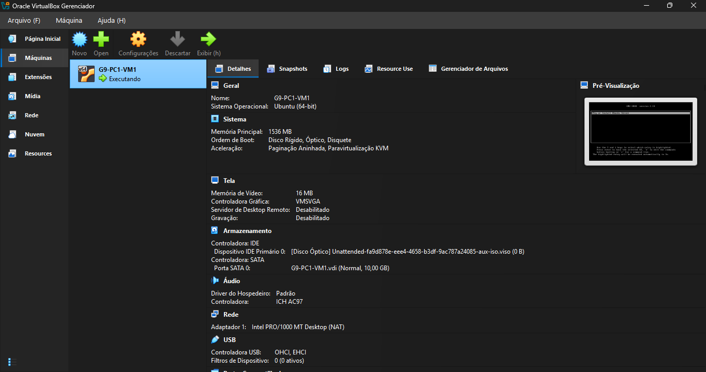

Com a VM em execução, o instalador do Ubuntu Server assume o controle da console, carregando os scripts de inicialização automática via linha de comando (CLI):

*<p align="center">Figura 4: Tela de carregamento do Kernel e execução dos scripts em segundo plano do instalador do Ubuntu Server.</p>*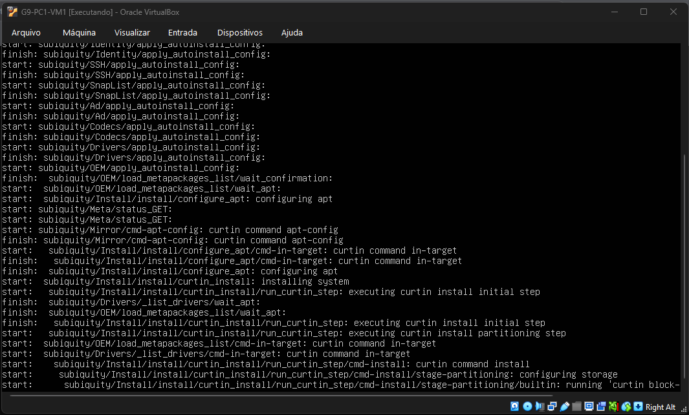

Após o término dos procedimentos de instalação e o reboot automático do sistema, o terminal de texto é liberado. O acesso ao console da VM Matriz é validado com sucesso inserindo o usuário administrador e a senha previamente configurados:

*<p align="center">Figura 5: Autenticação realizada com sucesso, exibindo o prompt de comando operativo do usuário admin.</p>*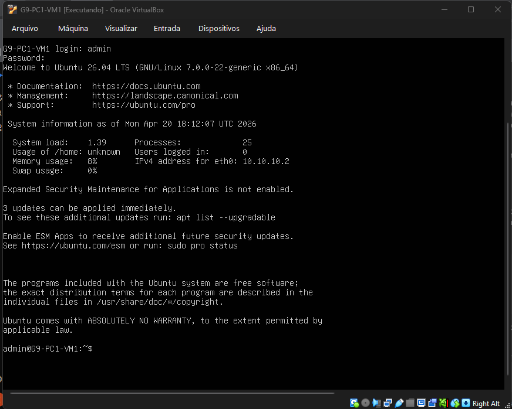

### 1.3 Idioma e Leyout do Teclado e localização

Verifique a configuração de idioma atual:

```bash
localectl status
```

Instale o pacote de idioma português:

```bash
sudo apt install language-pack-pt -y
sudo localectl set-locale LANG=pt_BR.utf8
```

Atualize o leyout do teclado para o padrão português abnt:
```bash
sudo dpkg-reconfigure keyboard-configuration
sudo reboot
```
> nota: Uma tela azul vai aparecer no terminal. Selecione as seguintes opções (use as setas e a tecla Enter):

- **Modelo do teclado**: Escolha o padrão (geralmente Generic 105-key PC).
- **País de origem**: Portuguese (Brazil).
- **Layout**: Portuguese (Brazil) ou Portuguese (Brazil) - ABNT2.

Continue dando OK nas opções restantes até o assistente fechar.

**Justificativa:** O layout `br`/`abnt2` garante a utilização correta do teclado brasileiro no Ubuntu, permitindo a digitação adequada de caracteres acentuados e símbolos especiais. Após a reconfiguração, é necessário reiniciar o sistema para aplicar as alterações.

Após o reboot, acesse a VM e teste se o teclado está devidademente configurado com `localectl status` e testando as teclas.

*<p align="center">Figura 6: Saída das configurações de idioma e teclado após execução dos comandos.</p>*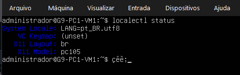

### 1.4 Atualização de Utilitários e Serviços de Rede

Atualize os pacotes do sistema e instale ferramentas de diagnóstico de rede:

```bash
sudo apt update && sudo apt upgrade -y
sudo apt install net-tools -y
```

#### O que os comandos fazem?

* `apt update`: atualiza a lista de pacotes disponíveis nos repositórios.
* `apt upgrade -y`: instala as versões mais recentes dos pacotes já instalados.
* `net-tools`: instala utilitários clássicos de rede, como `ifconfig`, `netstat`, `route` e `arp`.

#### Verificação

Após a instalação, execute:

```bash
ifconfig
```

O comando deve exibir as interfaces de rede disponíveis na máquina virtual.

*<p align="center">Figura 7: Saída das configurações de interface de rede disponíveis.</p>*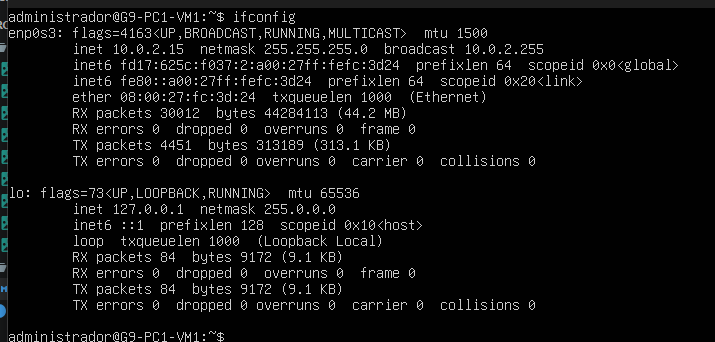

**Justificativa:** Manter o sistema atualizado reduz problemas de compatibilidade e segurança durante o projeto. Além disso, o pacote `net-tools` fornece ferramentas úteis para visualizar e diagnosticar configurações de rede, auxiliando na configuração dos endereços IP, testes de conectividade e validação da comunicação entre as máquinas virtuais.

### 1.5 Instalação e Configuração do SSH

Instale o servidor SSH e configure sua inicialização automática:

```bash
sudo apt install openssh-server -y
sudo systemctl enable --now ssh
```

#### O que os comandos fazem?

- `sudo apt install openssh-server -y`: instala o servidor SSH no sistema, permitindo conexões remotas à máquina virtual.
- `sudo systemctl enable --now ssh`: inicia o serviço SSH imediatamente e o configura para iniciar automaticamente sempre que o sistema for ligado.

#### Verificação

Verifique se o serviço está em execução:

```bash
sudo systemctl status ssh
```

O resultado deve indicar que o serviço está com o status `active (running)`.

*<p align="center">Figura 8: Saída das configurações do serviço SSH ativo.</p>*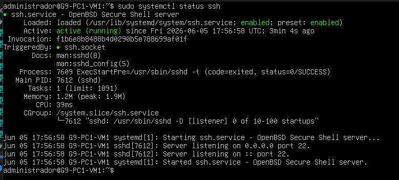

**Justificativa:** O SSH será utilizado para realizar os testes de acesso remoto exigidos pelo projeto, permitindo a comunicação entre as máquinas virtuais por meio dos usuários criados e dos nomes de host configurados. Além disso, o protocolo SSH possibilita a administração remota segura dos servidores durante a execução e validação do ambiente de rede.

### 1.6 Criação dos Usuários

Execute os comandos abaixo para criar os 4 usuários integrantes e adicioná-los ao grupo sudo:
```bash
sudo adduser --force-badname henrique.carvalho
sudo adduser --force-badname andrey.araujo
sudo adduser --force-badname eduardo.calado
sudo adduser --force-badname cirilo.silva
```
O parâmetro `--force-badname` é utilizado para que o Ubuntu não reclame do padrão de nomeclatura considerada ruim.*<p align="center">Figura 9: Ubuntu reclamando da convenção de nomes.</p>*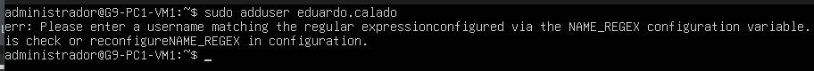

Todos os usuários foram criados com a senha padrão:`grupo9@2026`

Foi adicionado também privilégios de adminustrador `sudo` aos usuários:
```bash
sudo usermod -aG sudo henrique_carvalho
sudo usermod -aG sudo andrey_araujo
sudo usermod -aG sudo eduardo_calado
sudo usermod -aG sudo cirilo_silva
```
*<p align="center">Figura 10: Exemplo da criação de um usuário.</p>*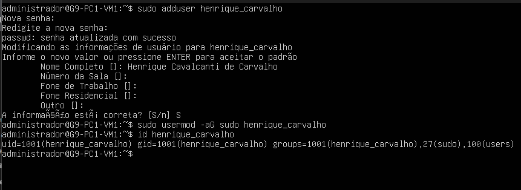
> O comando `id < usuário >` retorna o usuário criado!

É possivel verificar também a pasta dos usuários:
*<p align="center">Figura 11: Pasta no diretório /home dos usuários criados.</p>*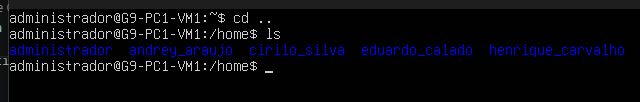

**Justificativa**: O projeto exige que todos os integrantes possuam contas em todas as instâncias virtuais. Ao criá-los na máquina matriz, evitamos a necessidade de rodar o comando adduser 32 vezes no dia da apresentação (4 usuários × 8 VMs).

### 1.7 Configurar IP estático Rede na VM principal

Verifique o nome do arquivo de configuração de rede gerenciado pelo Netplan:
```bash
sudo ls /etc/netplan/
```

Saída esperada:
```bash
00-installer-config.yaml
```

Edite o arquivo de configuração:
```bash
sudo nano /etc/netplan/00-installer-config.yaml
```

Altere o conteúdo para:
```yaml
network:
  ethernets:
    ens160:
      dhcp4: false
      dhcp6: false
      match:
        macaddress: 08:00:27:96:9d:7e # troque para o endereço MAC da VM
      set-name: ens160
      addresses:
        - 192.168.26.129/28 # troque aqui para o ip estático da VM
      routes:
        - to: default
          via: 192.168.26.129
      nameservers:
        addresses: [8.8.8.8, 8.8.4.4]
        search: [grupo9.bsi-26-1.maceio.lab]
  version: 2
```

Após salvar as alterações, aplique a configuração e verifique se a interface recebeu o endereço IP definido:
```bash
sudo netplan apply
ifconfig -a
```

**O que os comandos fazem?**

`ls /etc/netplan/`: identifica o arquivo de configuração de rede utilizado pelo sistema.

`netplan apply`: aplica imediatamente as alterações realizadas no arquivo YAML.

`ifconfig -a`: exibe as interfaces de rede e seus respectivos endereços IP.

**Justificativa**: A utilização de endereços IP estáticos é necessária para garantir que cada máquina virtual mantenha sempre o mesmo endereço na rede. Isso facilita a configuração dos arquivos hosts, a comunicação entre as VMs, os testes de conectividade com ping e os acessos remotos via SSH, além de atender aos requisitos de endereçamento definidos para o projeto.

#### Configurar mapeamento de hosts

Dentro do diretótio `/etc/hosts`, adicione o mapeamento abaixo de todas as VMS:

```bash
192.168.26.129  g9-pc1-vm1.grupo9.bsi-26-1.maceio.lab  g9-pc1-vm1
192.168.26.130  g9-pc1-vm2.grupo9.bsi-26-1.maceio.lab  g9-pc1-vm2
192.168.26.131  g9-pc2-vm1.grupo9.bsi-26-1.maceio.lab  g9-pc2-vm1
192.168.26.132  g9-pc2-vm2.grupo9.bsi-26-1.maceio.lab  g9-pc2-vm2
192.168.26.133  g9-pc3-vm1.grupo9.bsi-26-1.maceio.lab  g9-pc3-vm1
192.168.26.134  g9-pc3-vm2.grupo9.bsi-26-1.maceio.lab  g9-pc3-vm2
192.168.26.135  g9-pc4-vm1.grupo9.bsi-26-1.maceio.lab  g9-pc4-vm1
192.168.26.136  g9-pc4-vm2.grupo9.bsi-26-1.maceio.lab  g9-pc4-vm2
```

**O que essa configuração faz?**

O arquivo `/etc/hosts` permite associar nomes de máquinas a endereços IP localmente, sem a necessidade de um servidor DNS. Dessa forma, cada VM consegue localizar as demais utilizando seus nomes curtos (*hostname*) ou seus nomes completos (FQDN).

**Justificativa**: O projeto exige a utilização de hostnames e domínios para comunicação entre as máquinas virtuais. O mapeamento no arquivo `/etc/hosts` garante a resolução de nomes dentro do ambiente virtualizado, permitindo a realização dos testes de conectividade (`ping`) e acesso remoto (SSH) utilizando os nomes definidos.

### 1.8 Ajustes Necessários Antes da Clonagem

Após a instalação completa do sistema operacional e dos serviços necessários para o projeto, foi observado um consumo médio de aproximadamente **205 MB** de memória RAM por máquina virtual. Considerando que os serviços utilizados no ambiente (SSH, configuração de rede e ferramentas de diagnóstico) possuem baixo consumo de recursos, optou-se por reduzir a memória alocada de **2 GB** para **768 MB** por VM. Essa configuração mantém uma margem confortável para a execução das atividades propostas e possibilita a execução simultânea de duas máquinas virtuais por computador, utilizando aproximadamente 1,5 GB de RAM no total.

*<p align="center">Figura 12: Consumo de RAM após instalações e configuração básica.</p>*

*<p align="center">Figura 13: Alteração de alocação de memória RAM da VM.</p>*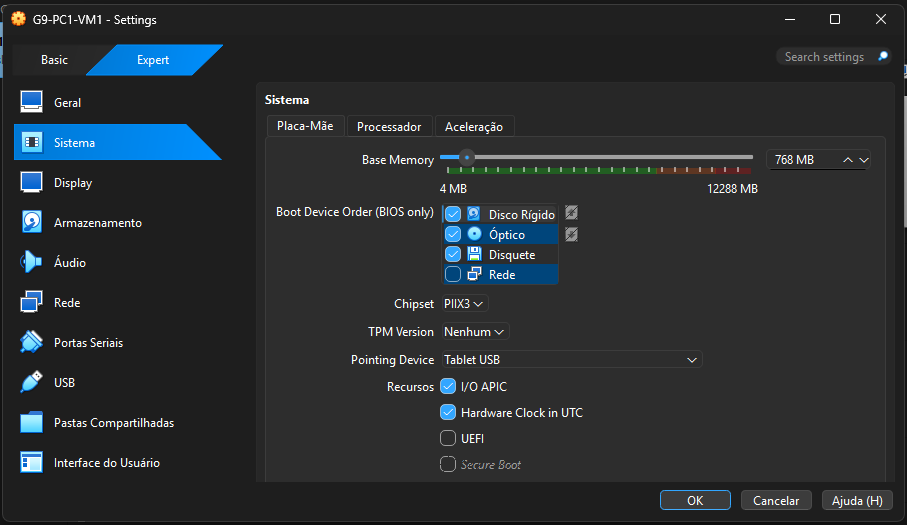

Também foi necessário alterar o adaptador de rede de **NAT** para **Placa em Modo Bridge** (Adaptador em Ponte).

*<p align="center">Figura 14: Alteração das configurações de adaptador de rede.</p>*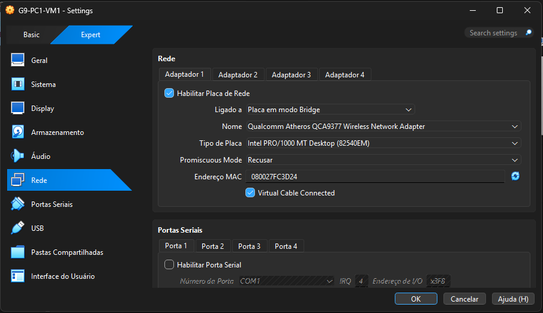

**Justificativa**: O modo Bridge conecta a máquina virtual diretamente à rede física do computador hospedeiro, permitindo que ela receba um endereço IP próprio e possa ser acessada por outros dispositivos da mesma rede. Essa configuração facilita os testes de conectividade e acesso remoto via SSH, além de permitir a comunicação entre as máquinas virtuais e outros computadores utilizados durante a apresentação e validação do projeto.

### 1.9 Clonagem das Máquinas Virtuais

Antes de iniciar a clonagem, deve-se habilitar a opção *"Gerar novos endereços MAC para todos os adaptadores de rede"*. Cada máquina virtual precisa possuir um endereço MAC único para evitar conflitos de identificação na rede e garantir o funcionamento correto dos serviços de comunicação.

*<p align="center">Figura 15: Etapa de clonagem das VMs.</p>*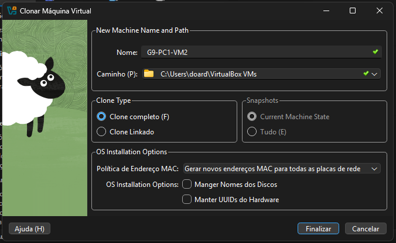

**Justificativa**: A clonagem foi utilizada para acelerar a criação do ambiente do projeto, permitindo reaproveitar uma máquina virtual base já configurada. Após a clonagem, foram realizados apenas os ajustes individuais de hostname, endereço IP e demais configurações específicas de cada servidor.

# Parte 2: Configurações específicas por VM
Nesta seção será apresentada as modificações das configurações básicas feitas que devem ser específicas a cada VM, como o endereço IP e MAC.

Repita essas configurações para cada VM de acordo com os dados especícos atrelado a ela.

### 2.1 Alteração do IP estático e MEC

Inicialmente, identifique o endereço MAC atribuído à máquina virtual executando o comando:

```bash
ip link | grep ether
```
`ip link`: É o comando que lista os detalhes e o status de todas as interfaces de rede da máquina (como lo, enp0s3 ou ens160).

`grep ether`: É um filtro de texto. Ele varre o que recebeu do pipe e exibe apenas as linhas que possuem a palavra "ether".

*<p align="center">Figura 16: Endereço Mac da VM distribuida pelo VirtualBox.</p>*

Após identificar o endereço MAC e consultar a tabela de endereçamento do grupo para determinar o IP correspondente à VM, edite o arquivo de configuração da rede:

```bash
sudo nano /etc/netplan/00-installer-config.yaml
```

Altere o conteúdo para:
```yaml
network:
  ethernets:
    ens160:
      dhcp4: false
      dhcp6: false
      match:
        macaddress: <Endereço MAC da VM> # troque para o endereço MAC da VM
      set-name: ens160
      addresses:
        - <IP da VM>/28 # troque aqui para o ip estático da VM
      routes:
        - to: default
          via: 192.168.26.129
      nameservers:
        addresses: [8.8.8.8, 8.8.4.4]
        search: [grupo9.bsi-26-1.maceio.lab]
  version: 2
```

Após salvar as alterações, aplique a configuração e verifique se a interface recebeu o endereço IP definido:
```bash
sudo netplan apply
ifconfig -a
```

**O que os comandos fazem?**

`ls /etc/netplan/`: identifica o arquivo de configuração de rede utilizado pelo sistema.

`netplan apply`: aplica imediatamente as alterações realizadas no arquivo YAML.

`ifconfig -a`: exibe as interfaces de rede e seus respectivos endereços IP.

**Justificativa**: Como as máquinas foram criadas a partir de clones, cada VM deve possuir um endereço MAC e um endereço IP exclusivos. Essa configuração evita conflitos de rede e garante a correta comunicação entre os hosts do ambiente virtualizado.

### 2.2 Definir Hostname

Configure o *hostname* da máquina virtual utilizando o padrão definido para o projeto:

```bash
sudo hostnamectl set-hostname <Nome da VM>
hostname   # verifique
```

O que os comandos fazem?
`hostnamectl set-hostname`: define o nome permanente da máquina.
`hostname`: exibe o hostname atual.
`hostname -f`: exibe o nome completo da máquina (FQDN).

**Justificativa**: A definição de hostnames únicos é um requisito do projeto e facilita a identificação dos servidores durante os testes de conectividade, resolução de nomes e acessos remotos via SSH.

Dentro do diretótio `/etc/hosts` (*Mesma pasta em que definimos o mapeamento de todos os IPS das VMs*), altere o endereço de retorno abaixo de `localhost`:

```bash
172.0.0.1  localhost
172.0.1.1  <hostname>.grupo9.bsi-26-1.maceio.lab  <hostname>

# exemplo:
172.0.1.1  g9-pc1-vm1.grupo9.bsi-26-1.maceio.lab  g9-pc1-vm1
```

### 2.3 Configurações Individuais por VM

Esta seção apresenta os comandos exatos a serem executados em cada VM clonada (do clone 2 ao 8), de forma redundante e completa. Para cada máquina, basta seguir os passos na ordem indicada.

---

#### G9-PC1-VM2 — IP: `192.168.26.130`

**1. Definir o hostname:**
```bash
sudo hostnamectl set-hostname g9-pc1-vm2
hostname   # verifique
```

**2. Editar o arquivo de configuração de rede:**
```bash
sudo nano /etc/netplan/00-installer-config.yaml
```

Substitua o conteúdo pelo seguinte:
```yaml
network:
  ethernets:
    enp0s3:
      dhcp4: false
      dhcp6: false
      match:
        macaddress: 08:00:27:5c:cd:ee
      set-name: ens160
      addresses:
        - 192.168.26.130/28
      routes:
        - to: default
          via: 192.168.26.129
      nameservers:
        addresses: [8.8.8.8, 8.8.4.4]
        search: [grupo9.bsi-26-1.maceio.lab]
  version: 2
```

**3. Editar o arquivo `/etc/hosts` — linha de loopback local:**
```bash
sudo nano /etc/hosts
```

Altere a linha de identificação local para:
```
172.0.1.1  g9-pc1-vm2.grupo9.bsi-26-1.maceio.lab  g9-pc1-vm2
```

**4. Aplicar as configurações e verificar:**
```bash
sudo netplan apply
ifconfig -a
hostname -f
```

---

#### G9-PC2-VM1 — IP: `192.168.26.131`

**1. Definir o hostname:**
```bash
sudo hostnamectl set-hostname g9-pc2-vm1
hostname   # verifique
```

**2. Editar o arquivo de configuração de rede:**
```bash
sudo nano /etc/netplan/00-installer-config.yaml
```

Substitua o conteúdo pelo seguinte:
```yaml
network:
  ethernets:
    enp0s3:
      dhcp4: false
      dhcp6: false
      match:
        macaddress: 08:00:27:62:06:77
      set-name: ens160
      addresses:
        - 192.168.26.131/28
      routes:
        - to: default
          via: 192.168.26.129
      nameservers:
        addresses: [8.8.8.8, 8.8.4.4]
        search: [grupo9.bsi-26-1.maceio.lab]
  version: 2
```

**3. Editar o arquivo `/etc/hosts` — linha de loopback local:**
```bash
sudo nano /etc/hosts
```

Altere a linha de identificação local para:
```
172.0.1.1  g9-pc2-vm1.grupo9.bsi-26-1.maceio.lab  g9-pc2-vm1
```

**4. Aplicar as configurações e verificar:**
```bash
sudo netplan apply
ifconfig -a
hostname -f
```

---

#### G9-PC2-VM2 — IP: `192.168.26.132`

**1. Definir o hostname:**
```bash
sudo hostnamectl set-hostname g9-pc2-vm2
hostname   # verifique
```

**2. Editar o arquivo de configuração de rede:**
```bash
sudo nano /etc/netplan/00-installer-config.yaml
```

Substitua o conteúdo pelo seguinte:
```yaml
network:
  ethernets:
    enp0s3:
      dhcp4: false
      dhcp6: false
      match:
        macaddress: 08:00:27:da:80:f9
      set-name: ens160
      addresses:
        - 192.168.26.132/28
      routes:
        - to: default
          via: 192.168.26.129
      nameservers:
        addresses: [8.8.8.8, 8.8.4.4]
        search: [grupo9.bsi-26-1.maceio.lab]
  version: 2
```

**3. Editar o arquivo `/etc/hosts` — linha de loopback local:**
```bash
sudo nano /etc/hosts
```

Altere a linha de identificação local para:
```
172.0.1.1  g9-pc2-vm2.grupo9.bsi-26-1.maceio.lab  g9-pc2-vm2
```

**4. Aplicar as configurações e verificar:**
```bash
sudo netplan apply
ifconfig -a
hostname -f
```

---

#### G9-PC3-VM1 — IP: `192.168.26.133`

**1. Definir o hostname:**
```bash
sudo hostnamectl set-hostname g9-pc3-vm1
hostname   # verifique
```

**2. Editar o arquivo de configuração de rede:**
```bash
sudo nano /etc/netplan/00-installer-config.yaml
```

Substitua o conteúdo pelo seguinte:
```yaml
network:
  ethernets:
    enp0s3:
      dhcp4: false
      dhcp6: false
      match:
        macaddress: 08:00:27:ed:82:f3
      set-name: ens160
      addresses:
        - 192.168.26.133/28
      routes:
        - to: default
          via: 192.168.26.129
      nameservers:
        addresses: [8.8.8.8, 8.8.4.4]
        search: [grupo9.bsi-26-1.maceio.lab]
  version: 2
```

**3. Editar o arquivo `/etc/hosts` — linha de loopback local:**
```bash
sudo nano /etc/hosts
```

Altere a linha de identificação local para:
```
172.0.1.1  g9-pc3-vm1.grupo9.bsi-26-1.maceio.lab  g9-pc3-vm1
```

**4. Aplicar as configurações e verificar:**
```bash
sudo netplan apply
ifconfig -a
hostname -f
```

---

#### G9-PC3-VM2 — IP: `192.168.26.134`

**1. Definir o hostname:**
```bash
sudo hostnamectl set-hostname g9-pc3-vm2
hostname   # verifique
```

**2. Editar o arquivo de configuração de rede:**
```bash
sudo nano /etc/netplan/00-installer-config.yaml
```

Substitua o conteúdo pelo seguinte:
```yaml
network:
  ethernets:
    enp0s3:
      dhcp4: false
      dhcp6: false
      match:
        macaddress: 08:00:27:bd:19:3a
      set-name: ens160
      addresses:
        - 192.168.26.134/28
      routes:
        - to: default
          via: 192.168.26.129
      nameservers:
        addresses: [8.8.8.8, 8.8.4.4]
        search: [grupo9.bsi-26-1.maceio.lab]
  version: 2
```

**3. Editar o arquivo `/etc/hosts` — linha de loopback local:**
```bash
sudo nano /etc/hosts
```

Altere a linha de identificação local para:
```
172.0.1.1  g9-pc3-vm2.grupo9.bsi-26-1.maceio.lab  g9-pc3-vm2
```

**4. Aplicar as configurações e verificar:**
```bash
sudo netplan apply
ifconfig -a
hostname -f
```

---

#### G9-PC4-VM1 — IP: `192.168.26.135`

**1. Definir o hostname:**
```bash
sudo hostnamectl set-hostname g9-pc4-vm1
hostname   # verifique
```

**2. Editar o arquivo de configuração de rede:**
```bash
sudo nano /etc/netplan/00-installer-config.yaml
```

Substitua o conteúdo pelo seguinte:
```yaml
network:
  ethernets:
    enp0s3:
      dhcp4: false
      dhcp6: false
      match:
        macaddress: 08:00:27:ed:16:ff
      set-name: ens160
      addresses:
        - 192.168.26.135/28
      routes:
        - to: default
          via: 192.168.26.129
      nameservers:
        addresses: [8.8.8.8, 8.8.4.4]
        search: [grupo9.bsi-26-1.maceio.lab]
  version: 2
```

**3. Editar o arquivo `/etc/hosts` — linha de loopback local:**
```bash
sudo nano /etc/hosts
```

Altere a linha de identificação local para:
```
172.0.1.1  g9-pc4-vm1.grupo9.bsi-26-1.maceio.lab  g9-pc4-vm1
```

**4. Aplicar as configurações e verificar:**
```bash
sudo netplan apply
ifconfig -a
hostname -f
```

---

#### G9-PC4-VM2 — IP: `192.168.26.136`

**1. Definir o hostname:**
```bash
sudo hostnamectl set-hostname g9-pc4-vm2
hostname   # verifique
```

**2. Editar o arquivo de configuração de rede:**
```bash
sudo nano /etc/netplan/00-installer-config.yaml
```

Substitua o conteúdo pelo seguinte:
```yaml
network:
  ethernets:
    enp0s3:
      dhcp4: false
      dhcp6: false
      match:
        macaddress: 08:00:27:77:57:51
      set-name: ens160
      addresses:
        - 192.168.26.136/28
      routes:
        - to: default
          via: 192.168.26.129
      nameservers:
        addresses: [8.8.8.8, 8.8.4.4]
        search: [grupo9.bsi-26-1.maceio.lab]
  version: 2
```

**3. Editar o arquivo `/etc/hosts` — linha de loopback local:**
```bash
sudo nano /etc/hosts
```

Altere a linha de identificação local para:
```
172.0.1.1  g9-pc4-vm2.grupo9.bsi-26-1.maceio.lab  g9-pc4-vm2
```

**4. Aplicar as configurações e verificar:**
```bash
sudo netplan apply
ifconfig -a
hostname -f
```

# Parte 3: Testes e Evidências

O detalhamento completo do script de teste automatizado, juntamente com o roteiro de testes manuais e os prints de validação de cada VM estão centralizados no documento unificado de evidências.

👉 **[Clique aqui para acessar o Relatório de Evidências e Testes Manuais](./evidencias.mdd)**
