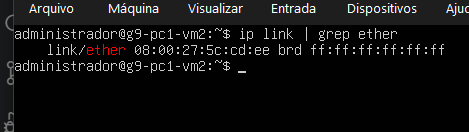

# Parte 2: Configurações específicas por VM
Nesta seção será apresentada as modificações das configurações básicas feitas que devem ser específicas a cada VM, como o endereço IP e MAC.

### 2.1 Alteração do IP estático e MEC

Inicialmente, identifique o endereço MAC atribuído à máquina virtual executando o comando:

```bash
ip link | grep ether
```
`ip link`: É o comando que lista os detalhes e o status de todas as interfaces de rede da máquina (como lo, enp0s3 ou ens160).

`grep ether`: É um filtro de texto. Ele varre o que recebeu do pipe e exibe apenas as linhas que possuem a palavra "ether".

*<p align="center">Figura 1: Endereço Mac da VM distribuida pelo VirtualBox.</p>*

Após identificar o endereço MAC e consultar a tabela de endereçamento do grupo para determinar o IP correspondente à VM, edite o arquivo de configuração da rede:

```bash
sudo nano /etc/netplan/00-installer-config.yaml
```

Altere o conteúdo para:
```yaml
network:
  ethernets:
    ens160:
      dhcp4: false
      dhcp6: false
      match:
        macaddress: <Endereço MAC da VM> # troque para o endereço MAC da VM
      set-name: ens160
      addresses:
        - <IP da VM>/28 # troque aqui para o ip estático da VM
      routes:
        - to: default
          via: 192.168.26.129
      nameservers:
        addresses: [8.8.8.8, 8.8.4.4]
        search: [grupo9.bsi-26-1.maceio.lab]
  version: 2
```

Após salvar as alterações, aplique a configuração e verifique se a interface recebeu o endereço IP definido:
```bash
sudo netplan apply
ifconfig -a
```

**O que os comandos fazem?**

`ls /etc/netplan/`: identifica o arquivo de configuração de rede utilizado pelo sistema.

`netplan apply`: aplica imediatamente as alterações realizadas no arquivo YAML.

`ifconfig -a`: exibe as interfaces de rede e seus respectivos endereços IP.

**Justificativa**: Como as máquinas foram criadas a partir de clones, cada VM deve possuir um endereço MAC e um endereço IP exclusivos. Essa configuração evita conflitos de rede e garante a correta comunicação entre os hosts do ambiente virtualizado.

### 2.2 Definir Hostname

Configure o *hostname* da máquina virtual utilizando o padrão definido para o projeto:

```bash
sudo hostnamectl set-hostname <Nome da VM>
hostname   # verifique
```

O que os comandos fazem?
`hostnamectl set-hostname`: define o nome permanente da máquina.
`hostname`: exibe o hostname atual.
`hostname -f`: exibe o nome completo da máquina (FQDN).

**Justificativa**: A definição de hostnames únicos é um requisito do projeto e facilita a identificação dos servidores durante os testes de conectividade, resolução de nomes e acessos remotos via SSH.

### 2.3 Testes automatizados de conexão